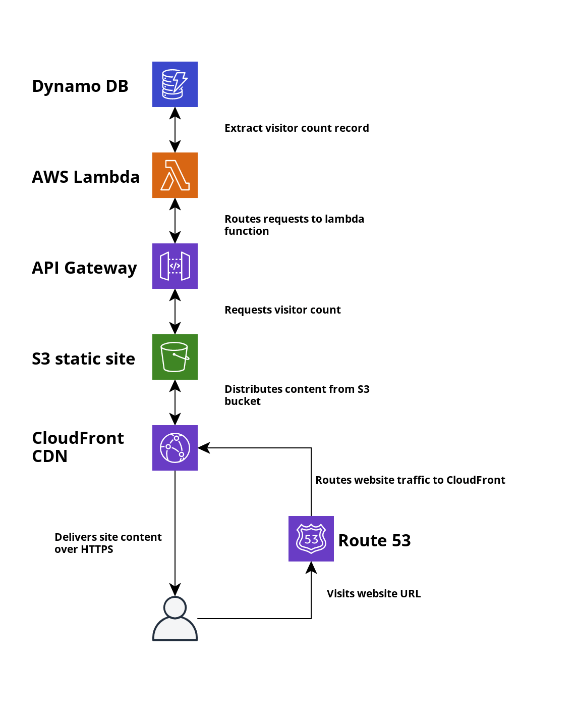

##About:
This repo contains the code to provision my Cloud Resume Website at [https://www.ikkidev.com](https://www.ikkidev.com) 
inspired by the [Cloud Resume Challenge](https://cloudresumechallenge.dev/docs/the-challenge/aws/). I have a more 
detailed write-up on my journey with the challenge up on my blog: [https://miraclecoder.com](https://miraclecoder.com/). 
All the AWS services that I used for hosting my website on AWS is recorded on the architecture diagram below:


##Prerequisite:
1. AWS account to provision resources. I use [awsume](https://awsu.me) to manage my aws profile configurations
   ``` 
    To assume a profile simply do
        awsume dev
        awsume admin-prod-role

    To configure an aws profile
        aws configure --profile dev

    To list all available profiles
        awsume --list-profiles
    ```
   
2. S3 bucket to store terraform remote state must have been created beforehand
following the name in the [tfbackend file](terraform-cloud-resume/env/dev.s3.tfbackend)

3. Domain name for hosting the website.

##Manual Provisioning:  
Environment files are defined in the [env directory](terraform-cloud-resume/env).
This is where I centralize all the variables that are critical to the different terraform modules. 
such as the name of the S3 bucket where the website is hosted.

To provision a module simply run from the module directory:  
- cd terraform-cloud-resume\modules\dynamodb
- terraform apply -var-file="..\..\env\dev.tfvars"

To provision the entire AWS resources for the cloud resume website run:  
- cd terraform-cloud-resume
- run terraform init -reconfigure -backend-config="env\dev.s3.tfbackend"
- terraform apply -var-file="env\dev.tfvars"

##Testing:
To invoke the lambda manually:
- aws lambda invoke --region=us-east-1 --function-name=$(terraform
  output -raw lambda_function_name) response.json  
```
{
    "StatusCode": 200,
    "ExecutedVersion": "$LATEST"
}
```
- cat response.json  
```
{
   "statusCode": 200, 
   "body": "{\"visitor_count\": 1}"
}
```

To invoke the API gateway endpoint manually:
- curl "$(terraform output -raw apigateway_base_url)/api/v1/visitor
   _count"  
```
    StatusCode        : 200
    StatusDescription : OK
    Content           : {"visitor_count": 3}
```

##Builds Provisioning:
This project makes use of github action workflow to automatically provision all the resources for the website on AWS.
on a code change to the default branch on this repo.
AWS access for the github action builds are controlled through the use of IAM roles instead of security credentials per  
security best practices.

