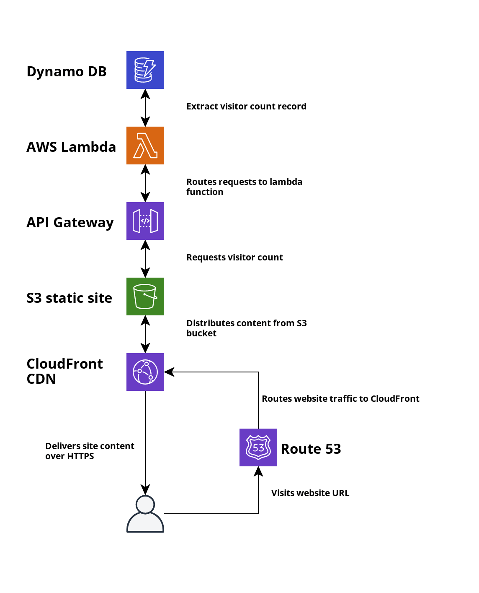

## About:
This repo contains the code to provision my Cloud Resume Website at [https://www.ikkidev.com](https://www.ikkidev.com) 
inspired by the [Cloud Resume Challenge](https://cloudresumechallenge.dev/docs/the-challenge/aws/). I have a more 
detailed write-up on my journey with the challenge up on my blog: [https://miraclecoder.com](https://miraclecoder.com/my-journey-with-the-cloud-resume-challenge/). 
The AWS services that I used for hosting my website on AWS is recorded on the architecture diagram below:


## Prerequisite:
1. AWS account to provision resources. I use [awsume](https://awsu.me) to manage my aws profile configurations
   ``` 
    To assume a profile simply do
        awsume dev
        awsume admin-prod-role

    To configure an aws profile
        aws configure --profile dev

    To list all available profiles
        awsume --list-profiles
    ```
   
2. S3 bucket to store terraform remote state must have been created beforehand
following the name in the [tfbackend file](terraform-cloud-resume/env/dev.s3.tfbackend)

3. Domain name for hosting the website.

## Manual Provisioning:  
Environment files are defined in the [env directory](terraform-cloud-resume/env).
This is where I centralize all the variables that are critical to the different terraform modules. 
such as the name of the S3 bucket where the website is hosted.

To provision a module simply run from the module directory:  
- cd terraform-cloud-resume\modules\dynamodb
- terraform apply -var-file="..\..\env\dev.tfvars"

To provision the entire AWS resources for the cloud resume website run:  
- cd terraform-cloud-resume
- run terraform init -reconfigure -backend-config="env\dev.s3.tfbackend"
- terraform apply -var-file="env\dev.tfvars"

## Testing:
To invoke the lambda manually using the AWS cli:
- aws lambda invoke --region=us-east-1 --function-name=$(terraform
  output -raw lambda_function_name) response.json  
```
{
    "StatusCode": 200,
    "ExecutedVersion": "$LATEST"
}
```
- cat response.json  
```
{
   "statusCode": 200, 
   "body": "{\"visitor_count\": 1}"
}
```

To invoke the API gateway endpoint manually using the curl command:
- curl "$(terraform output -raw apigateway_base_url)/api/v1/visitor
   _count"  
```
    StatusCode        : 200
    StatusDescription : OK
    Content           : {"visitor_count": 3}
```

## Deploying a content change to the live site

This is what I do when I need to update the resume content at [https://www.ikkidev.com](https://www.ikkidev.com):

1. Make the HTML change on a feature branch off `main`:
   ```bash
   git checkout main && git pull
   git checkout -b resume-update-<date>
   # edit Webpage/src/index.html
   git commit -am "Update resume content"
   git push -u origin resume-update-<date>
   ```
2. Open a PR and merge it into `main`. The merge push to `main` triggers [`.github/workflows/main.yml`](.github/workflows/main.yml), which runs the Lambda tests and `terraform apply` against the prod env.
3. The S3 module uses `aws_s3_object` with `filemd5` for every file under `Webpage/src/`, so any changed file gets re-uploaded on the next apply. No separate sync step.
4. **Invalidate the CloudFront cache.** Terraform does not do this for me, and the CDN will keep serving the old HTML until I tell it not to:
   ```bash
   awsume <prod-profile>
   aws cloudfront create-invalidation \
     --distribution-id <DIST_ID> \
     --paths "/" "/index.html"
   ```
   To find the distribution ID:
   ```bash
   # Option A: from terraform output, run from terraform-cloud-resume/
   terraform output

   # Option B: list distributions filtered by the ikkidev.com alias
   aws cloudfront list-distributions \
     --query "DistributionList.Items[?Aliases.Items[?contains(@, 'ikkidev.com')]].{Id:Id,Aliases:Aliases.Items}" \
     --output table
   ```
   There are two distributions (one for `www`, one for the apex redirect). The `www` one is the one to invalidate.

## CI auth (OIDC)

The workflow does not use long-lived AWS keys. It uses GitHub OIDC and assumes
`arn:aws:iam::521555160642:role/github-actions-role` in `ca-central-1`.

The trust policy on that role conditions on the GitHub token's `sub` claim, which looks like:
```
repo:ikkidev/CloudResume:ref:refs/heads/<branch>
```

**Important.** If I rename the default branch or rotate the role, the trust policy condition has to match the branch the workflow runs on. The repo's default branch is `main`, so the condition needs to be:
```json
"token.actions.githubusercontent.com:sub": "repo:ikkidev/CloudResume:ref:refs/heads/main"
```
If this drifts (e.g. stuck on `master` after a branch rename), the workflow fails at the "Configure aws credentials" step with an AssumeRole error and nothing deploys.

The workflow itself needs `permissions: id-token: write` so GitHub can mint the OIDC token. That block is already in `main.yml`.

